## 简介

Job化后`AraTrail.cs`的拖尾组件，优化性能

## 使用

保证`AraTrailJobManager.cs`生命周期比任何一个`AraTrailJob`都要早即可

## 参数

AraTrailJobManager常量参数配置错误会导致程序运行出错或崩溃

| AraTrailJobManager常量 | 说明                               | 默认值 |
| ---------------------- | ---------------------------------- | ------ |
| HEAD_SIZE              | AraTrailJob的最大个数              | 18    |
| POINT_CHUNK_SIZE       | 一个AraTrailJob对应的最大Point个数 | 100    |
| VERTICES_SIZE          | 一个Point会生成的顶点个数          | 50    |
| TRIANGLE_MUL           | 一个顶点会生成的三角面索引个数     | 3      |
| GRADIENT_COUNT         | Gradient 中的最大关键帧个数        | 8      |
| KEYFRAME_COUNT         | AnimationCurve中的最大关键点个数 | 16     |

Tips:

- Point个数会影响拖尾效果顶点个数，最终影响拖尾表现效果
- KEYFRAME_COUNT 太少会导致曲线数据获取有误

## 注意事项

1. 保证启用Burst编译

2. AraTrailJobManager提供打印内存占用情况功能

   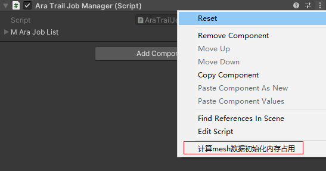

3. AraTrailJob的Time参数影响point生成的数量，POINT_CHUNK_SIZE，VERTICES_SIZE，TRIANGLE_MUL与其息息相关。
## 常见报错
- Failed setting triangles. Some indices are referencing out of bounds vertices. IndexCount: 432, VertexCount: 146

​		TRIANGLE_MUL 数值太低，请增加该数值

-  拖尾结果异常：连线乱飞

​		VERTICES_SIZE 数值太低，请增加该数值

## 优化性能对比

| 拖尾数量    | 普通拖尾 AraTrail                 | Job化后的拖尾AraTrailJob          |
| ----------- | --------------------------------- | --------------------------------- |
| 5           | 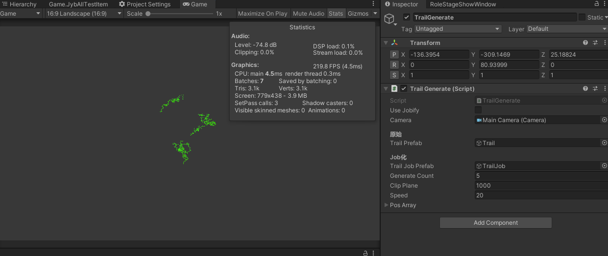           | 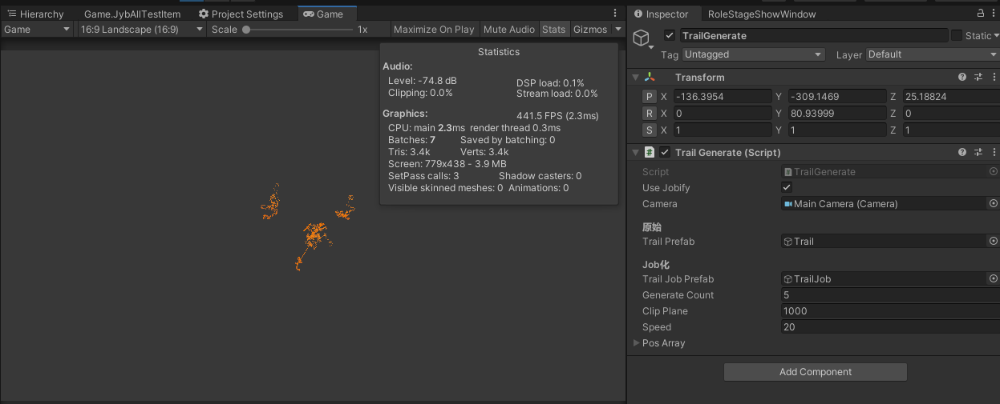           |
| 20          | 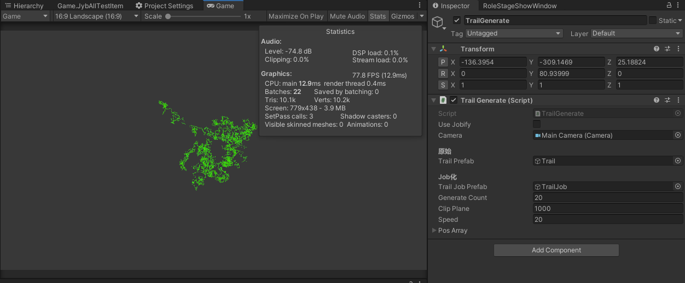          | 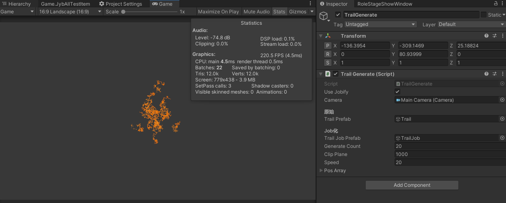          |
| 50          | 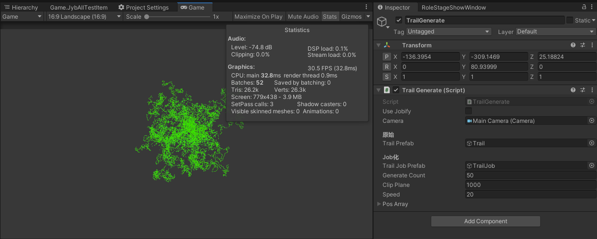          | 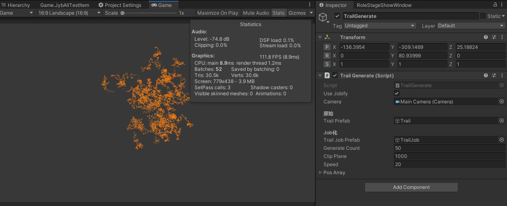          |
| 100         | 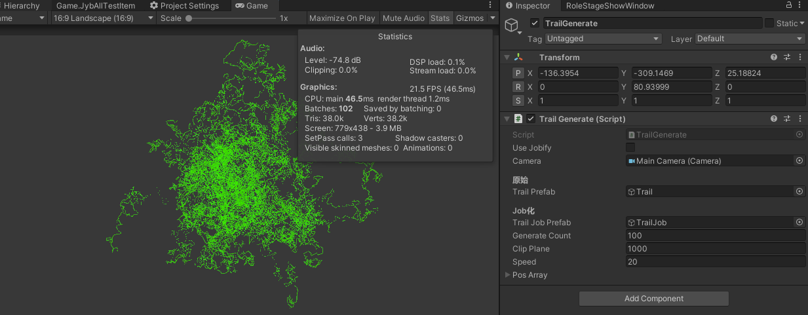         | 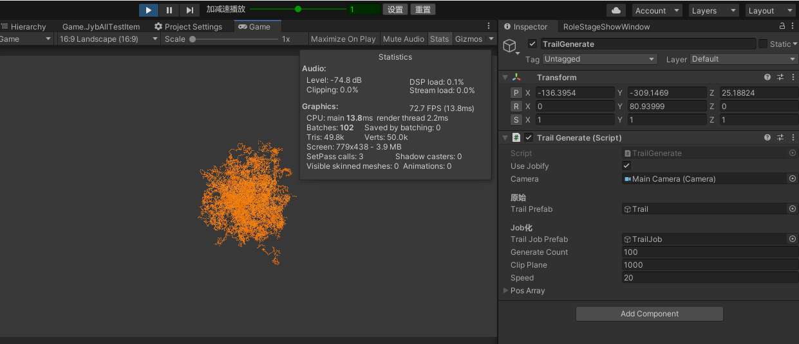         |
| 100profiler | 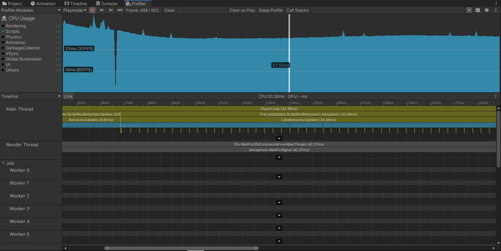 | 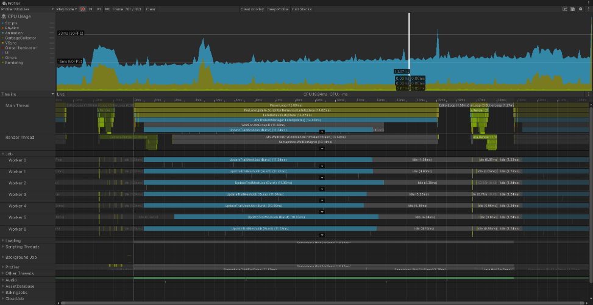 |

